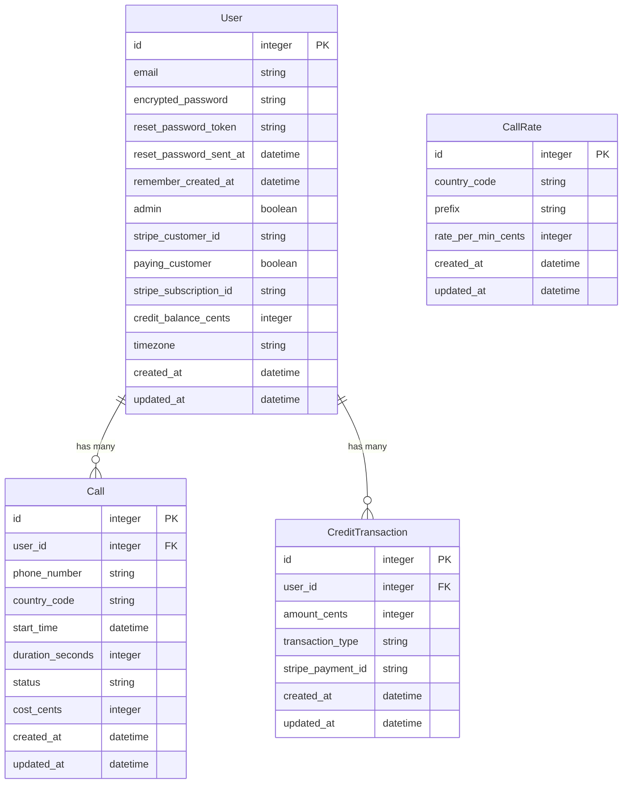
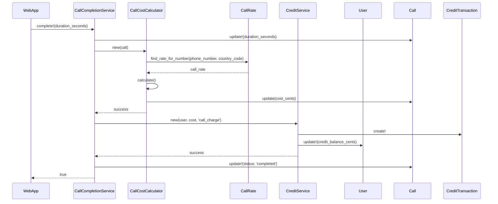

I'll create a comprehensive, developer-ready specification organized by sections that aligns with Rails 8 architecture and SaaS patterns.

# Papercup - Developer Specification

## 1. System Overview
```ruby
# config/application.rb additions
module Papercup
  class Application < Rails::Application
    config.active_job.queue_adapter = :sidekiq
    config.action_cable.mount_path = '/cable'
    config.middleware.use Rack::Cors
  end
end
```

## 2. Dependencies
```ruby
# Gemfile additions
source 'https://rubygems.org'

# Core functionality
gem 'webrtc-rails'           # WebRTC support
gem 'twilio-ruby'            # PSTN integration
gem 'stripe'                 # Payment processing
gem 'devise'                 # Authentication
gem 'omniauth-google-oauth2' # Google OAuth
gem 'sidekiq'               # Background jobs
gem 'redis'                 # Caching and ActionCable

# Frontend
gem 'jsbundling-rails'      # JavaScript bundling
gem 'stimulus-rails'        # Stimulus.js integration
gem 'turbo-rails'          # Turbo integration
gem 'tailwindcss-rails'    # CSS framework

# API and data handling
gem 'jsonapi-serializer'    # JSON API serialization
gem 'phonelib'             # Phone number validation
gem 'money-rails'          # Currency handling
gem 'chartkick'
gem 'groupdate'
```

## 3. Database Schema
```ruby
# db/migrate/YYYYMMDDHHMMSS_create_core_tables.rb

# Users table (extends devise)
create_table :users do |t|
  t.string :email, null: false
  t.decimal :credit_balance, precision: 10, scale: 2, default: 0
  t.string :timezone
  t.timestamps
end

# Call records
create_table :calls do |t|
  t.references :user, null: false
  t.string :phone_number, null: false
  t.string :country_code
  t.datetime :start_time
  t.integer :duration_seconds
  t.string :status
  t.decimal :cost, precision: 10, scale: 2
  t.timestamps
end

# Credit transactions
create_table :credit_transactions do |t|
  t.references :user, null: false
  t.decimal :amount, precision: 10, scale: 2
  t.string :transaction_type
  t.string :stripe_payment_id
  t.timestamps
end

# New model to add
class CallRate < ApplicationRecord
  validates :country_code, presence: true
  validates :prefix, presence: true, uniqueness: true
  monetize :rate_per_min_cents
  
  def self.find_rate(phone_number)
    # Logic to match longest prefix
    where("? LIKE prefix || '%'", phone_number)
      .order(length(prefix) DESC)
      .first
  end
end

# New migration
create_table :call_rates do |t|
  t.string :country_code, null: false
  t.string :prefix, null: false
  t.integer :rate_per_min_cents, null: false
  t.timestamps
  t.index :prefix
end
```

## 4. Models
```ruby
# app/models/user.rb
class User < ApplicationRecord
  devise :database_authenticatable, :registerable,
         :recoverable, :rememberable, :validatable,
         :confirmable, :trackable,  # Additional Devise modules
         :omniauthable, omniauth_providers: [:google_oauth2]
  
  # Add Money-Rails integration
  monetize :credits_cents
  
  # Add admin functionality
  scope :admins, -> { where(admin: true) }
  
  has_many :calls
  has_many :credit_transactions
  
  validates :email, presence: true, uniqueness: true
  validates :credit_balance, numericality: { greater_than_or_equal_to: 0 }
end

# app/models/call.rb
class Call < ApplicationRecord
  belongs_to :user
  
  validates :phone_number, presence: true
  validates :status, inclusion: { in: %w[initiated connected completed failed] }
  
  scope :recent, -> { order(created_at: :desc).limit(5) }
  scope :successful, -> { where(status: 'completed') }
  scope :by_country, -> { group(:country_code).count }
  scope :daily_volume, -> { group_by_day(:created_at).count }
  scope :revenue_by_day, -> { 
    successful.group_by_day(:created_at).sum(:cost_cents) 
  }
end

# New model for detailed call tracking
class CallEvent < ApplicationRecord
  belongs_to :call
  
  validates :event_type, presence: true
  validates :metadata, presence: true
  
  serialize :metadata, JSON
end

# New migration
create_table :call_events do |t|
  t.references :call, null: false
  t.string :event_type, null: false
  t.datetime :timestamp, null: false
  t.json :metadata
  t.timestamps
end
```

## 5. Controllers
```ruby
# app/controllers/calls_controller.rb
class CallsController < ApplicationController
  before_action :authenticate_user!
  before_action :check_credit_balance, only: [:create]

  def create
    @call = current_user.calls.build(call_params)
    
    if @call.save
      InitiateCallJob.perform_later(@call.id)
      render json: CallSerializer.new(@call)
    else
      render json: { errors: @call.errors }, status: :unprocessable_entity
    end
  end

  private

  def call_params
    params.require(:call).permit(:phone_number, :country_code)
  end

  def check_credit_balance
    unless current_user.sufficient_balance?
      render json: { error: 'Insufficient credits' }, status: :payment_required
    end
  end
end
```

## 6. Frontend Components (Stimulus)
```javascript
// app/javascript/controllers/dialer_controller.js
import { Controller } from "@hotwired/stimulus"
import { createConsumer } from "@rails/actioncable"

export default class extends Controller {
  static targets = ["input", "keypad", "callButton"]
  static values = {
    countryCode: String,
    balance: Number
  }

  connect() {
    this.setupWebRTC()
    this.subscribeToCall()
  }

  // Keypad input
  appendNumber(event) {
    const number = event.currentTarget.dataset.number
    this.inputTarget.value += number
  }

  // Initiate call
  async startCall() {
    if (!this.validateNumber()) return
    
    try {
      const response = await fetch('/calls', {
        method: 'POST',
        headers: {
          'Content-Type': 'application/json',
          'X-CSRF-Token': this.getCSRFToken()
        },
        body: JSON.stringify({
          call: {
            phone_number: this.inputTarget.value,
            country_code: this.countryCodeValue
          }
        })
      })
      
      if (!response.ok) throw new Error('Call failed to initiate')
      
      this.startWebRTCCall()
    } catch (error) {
      console.error('Call initiation failed:', error)
    }
  }
}
```

## 7. WebRTC Integration
```ruby
# app/services/call_service.rb
class CallService
  def initialize(call)
    @call = call
    @twilio_client = Twilio::REST::Client.new
  end

  def initiate
    token = generate_twilio_token
    broadcast_token_to_client
    connect_to_pstn
  end

  private

  def generate_twilio_token
    # Generate capability token for WebRTC client
  end

  def broadcast_token_to_client
    CallChannel.broadcast_to(
      @call.user,
      { token: token, call_sid: @call.id }
    )
  end

  def connect_to_pstn
    # Initiate PSTN connection via Twilio
  end
end
```

## 7.1 Twilio PSTN Integration

The application integrates with Twilio to enable outbound calling to regular phone numbers (PSTN).

### Environment Configuration
```ruby
# Required environment variables (.env)
TWILIO_ACCOUNT_SID=ACe749f7442ee156cfcd5c50367b4ba35c  # Your Twilio Account SID
TWILIO_AUTH_TOKEN=9fcb29f74c07a76ca8e06f8583c770ee    # Your Twilio Auth Token
TWILIO_PHONE_NUMBER=+19032705011                      # Your Twilio phone number
APP_HOST=your-domain.com                              # Your public domain (for webhooks)
```

### Twilio Configuration
```ruby
# config/initializers/twilio.rb
require 'twilio-ruby'

# Single configuration using environment variables
Twilio.configure do |config|
  config.account_sid = ENV['TWILIO_ACCOUNT_SID']
  config.auth_token = ENV['TWILIO_AUTH_TOKEN']
end

# Log Twilio configuration in development
if Rails.env.development?
  Rails.logger.info "Twilio initialized with Account SID: #{ENV['TWILIO_ACCOUNT_SID'].to_s.gsub(/.(?=.{4})/, '*')}"
  Rails.logger.info "Twilio Auth Token provided: #{ENV['TWILIO_AUTH_TOKEN'].present?}"
  Rails.logger.info "Twilio Phone Number configured as: #{ENV['TWILIO_PHONE_NUMBER']}"
end
```

### Call Initiation Job
```ruby
# app/jobs/initiate_call_job.rb
class InitiateCallJob < ApplicationJob
  queue_as :calls
  
  include Rails.application.routes.url_helpers
  
  def perform(call_id)
    call = Call.find_by(id: call_id)
    return unless call
    
    begin
      # Initialize Twilio client with explicit credentials to ensure proper authentication
      twilio_client = Twilio::REST::Client.new(ENV['TWILIO_ACCOUNT_SID'], ENV['TWILIO_AUTH_TOKEN'])
      
      # Make the call through Twilio
      twilio_call = twilio_client.calls.create(
        url: webhook_url(call),
        to: call.phone_number,
        from: ENV['TWILIO_PHONE_NUMBER'],
        status_callback: status_callback_url(call),
        status_callback_event: ['initiated', 'ringing', 'answered', 'completed'],
        status_callback_method: 'POST'
      )
      
      # Store the Twilio SID for future reference
      call.update(twilio_sid: twilio_call.sid, status: 'in_progress')
      
      # Create an event for the status update - must match the call status
      CallEvent.create!(
        call: call,
        event_type: 'in_progress',
        occurred_at: Time.current
      )
    rescue Twilio::REST::RestError => e
      # Handle Twilio errors
      call.update(status: 'failed', failure_reason: "twilio:#{e.code}")
      
      CallEvent.create!(
        call: call,
        event_type: 'failed',
        occurred_at: Time.current,
        metadata: { 
          error_code: e.code, 
          error_message: e.message 
        }
      )
    rescue => e
      # Handle other errors
      call.update(status: 'failed', failure_reason: 'system_error')
      
      CallEvent.create!(
        call: call,
        event_type: 'failed',
        occurred_at: Time.current,
        metadata: { error: e.message }
      )
    end
  end
  
  private
  
  # Generate webhook URL for TwiML
  def webhook_url(call)
    # Use the defined route helper with the correct format
    webhook_api_calls_url(format: 'xml', call_id: call.id, host: ENV['APP_HOST'])
  end
  
  # Generate status callback URL
  def status_callback_url(call)
    # Use the defined route helper with the correct format
    status_callback_api_calls_url(format: 'json', call_id: call.id, host: ENV['APP_HOST'])
  end
end
```

### API Routes for Twilio Webhooks
```ruby
# config/routes.rb
namespace :api do
  resources :calls do
    collection do
      # TwiML webhook for call instructions
      post :webhook
      get :webhook # Allow GET for TwiML webhooks (XML format)
      
      # Status callback endpoint (JSON format)
      post :status_callback
    end
  end
end
```

### TwiML Response Generation
```ruby
# app/controllers/api/calls_controller.rb (webhook method)
def webhook
  call_id = params[:call_id]
  call = Call.find_by(id: call_id)
  
  response = Twilio::TwiML::VoiceResponse.new do |r|
    if call
      r.say(message: "Thank you for accepting this call from Papercup.")
      r.pause(length: 1)
      r.say(message: "This call will be charged at our standard rates.")
      r.pause(length: 1)
      
      # Optional: Play hold music
      # r.play(url: 'https://demo.twilio.com/docs/classic.mp3')
    else
      r.say(message: "Sorry, there was an error with this call.")
      r.hangup
    end
  end
  
  render xml: response.to_s
end
```

### Status Callback Handling
```ruby
# app/controllers/api/calls_controller.rb (status_callback method)
def status_callback
  call_id = params[:call_id]
  status = params[:CallStatus]
  duration = params[:CallDuration]
  
  # Enqueue a job to update the call status
  UpdateCallStatusJob.perform_later(call_id, status, duration)
  
  head :ok
end
```

### Important Implementation Notes

1. **Webhook Accessibility**: Twilio needs to access your webhooks via public URLs. In development, use ngrok (`ngrok http 3000`) and set `APP_HOST` to your ngrok URL.

2. **Twilio Trial Limitations**: Trial accounts can only call verified numbers. Verify recipient numbers in the Twilio console.

3. **Consistent Status Values**: Ensure that Call model and CallEvent model use consistent status values to prevent validation errors.

4. **Authentication**: Always initialize the Twilio client with explicit credentials to avoid authentication issues:
   ```ruby
   twilio_client = Twilio::REST::Client.new(ENV['TWILIO_ACCOUNT_SID'], ENV['TWILIO_AUTH_TOKEN'])
   ```

5. **Background Job Processing**: Ensure Redis and Sidekiq are running to process the call jobs.

## 8. Background Jobs
```ruby
# app/jobs/initiate_call_job.rb
class InitiateCallJob < ApplicationJob
  queue_as :default

  def perform(call_id)
    call = Call.find(call_id)
    CallService.new(call).initiate
  end
end

# app/jobs/update_call_status_job.rb
class UpdateCallStatusJob < ApplicationJob
  queue_as :default

  def perform(call_id, status, duration = nil)
    call = Call.find(call_id)
    call.update!(
      status: status,
      duration_seconds: duration,
      cost: calculate_cost(duration)
    )
    
    deduct_user_credits(call) if status == 'completed'
  end
end

# app/jobs/call_billing_job.rb
class CallBillingJob < ApplicationJob
  queue_as :billing
  
  def perform(call_id)
    call = Call.find(call_id)
    return unless call.active?
    
    rate = call.call_rate
    duration = Time.current - call.start_time
    cost = calculate_cost(rate, duration)
    
    if call.user.credits_cents < cost
      CallHangupJob.perform_now(call_id)
    else
      call.user.update!(credits_cents: call.user.credits_cents - cost)
    end
  end
end

# app/jobs/fraud_detection_job.rb
class FraudDetectionJob < ApplicationJob
  queue_as :default
  
  def perform(user_id)
    user = User.find(user_id)
    if suspicious_activity?(user)
      notify_admin(user)
      user.update!(suspended: true)
    end
  end
end
```

## 9. API Endpoints
```ruby
# config/routes.rb
Rails.application.routes.draw do
  devise_for :users, controllers: { omniauth_callbacks: 'users/omniauth_callbacks' }
  
  resources :calls, only: [:create, :index]
  resources :credits, only: [:create]
  
  namespace :api do
    resources :countries, only: [:index]
    resources :rates, only: [:index]
  end
end
```

## 10. Testing Plan
```ruby
# spec/models/call_spec.rb
RSpec.describe Call, type: :model do
  describe 'validations' do
    it { should validate_presence_of(:phone_number) }
    it { should belong_to(:user) }
  end
end

# spec/system/making_call_spec.rb
RSpec.describe 'Making a call', type: :system do
  before do
    driven_by(:selenium_chrome_headless)
  end

  it 'allows user to make a call with sufficient credits' do
    # Test implementation
  end
end
```

## 11. Deployment Configuration
```yaml
# config/deploy.rb
set :application, 'papercup'
set :repo_url, 'git@github.com:username/papercup.git'

# Add media server configs
set :media_servers, %w{media1.papercup.com media2.papercup.com}
set :turn_servers, %w{turn1.papercup.com turn2.papercup.com}

# Add Hetzner-specific deployment tasks
namespace :deploy do
  task :setup_media_servers do
    on roles(:media) do
      # Setup Janus/FreeSWITCH
    end
  end
end
```

## 12. Environment Variables
```ruby
# config/credentials.yml.enc
twilio:
  account_sid: <%= ENV['TWILIO_ACCOUNT_SID'] %>
  auth_token: <%= ENV['TWILIO_AUTH_TOKEN'] %>
  app_sid: <%= ENV['TWILIO_APP_SID'] %>

stripe:
  publishable_key: <%= ENV['STRIPE_PUBLISHABLE_KEY'] %>
  secret_key: <%= ENV['STRIPE_SECRET_KEY'] %>

google_oauth2:
  client_id: <%= ENV['GOOGLE_CLIENT_ID'] %>
  client_secret: <%= ENV['GOOGLE_CLIENT_SECRET'] %>

media_server:
  janus_api_key: <%= ENV['JANUS_API_KEY'] %>
  freeswitch_event_socket: <%= ENV['FREESWITCH_ESL'] %>

monitoring:
  sentry_dsn: <%= ENV['SENTRY_DSN'] %>
  newrelic_key: <%= ENV['NEWRELIC_KEY'] %>
```

## Payment Integration with Stripe

### Completed Implementation
```ruby
# app/services/stripe_checkout_service.rb
class StripeCheckoutService
  def initialize(user, credit_package)
    @user = user
    @credit_package = credit_package
    @stripe_api_key = Rails.configuration.stripe[:api_key]
  end

  def create_session
    Stripe::Checkout::Session.create({
      payment_method_types: ['card'],
      line_items: [{
        price_data: {
          currency: 'usd',
          product_data: {
            name: "#{@credit_package.name} Credit Package"
          },
          unit_amount: @credit_package.price_cents
        },
        quantity: 1
      }],
      mode: 'payment',
      success_url: "#{Rails.configuration.stripe[:success_url]}?session_id={CHECKOUT_SESSION_ID}",
      cancel_url: Rails.configuration.stripe[:cancel_url],
      metadata: {
        user_id: @user.id,
        credit_package_id: @credit_package.id
      }
    })
  end
end

# app/controllers/api/credits_controller.rb
module Api
  class CreditsController < BaseController
    before_action :authenticate_user_from_token!

    # GET /api/credits (Transaction History)
    def index
      transactions = current_user.credit_transactions.order(created_at: :desc)
      render json: transactions
    end

    # GET /api/credits/show (Balance and Packages)
    def show
      render json: {
        balance: current_user.credit_balance,
        packages: CreditPackage.active
      }
    end

    # POST /api/credits/create_checkout_session
    def create_checkout_session
      credit_package = CreditPackage.find(params[:package_id])
      
      begin
        service = StripeCheckoutService.new(current_user, credit_package)
        session = service.create_session
        render json: { id: session.id }
      rescue Stripe::InvalidRequestError => e
        render json: { error: e.message }, status: :unprocessable_entity
      rescue StandardError => e
        Rails.logger.error "Checkout Session creation failed: #{e.message}"
        render json: { error: 'Could not create checkout session.' }, status: :internal_server_error
      end
    end

    private

    def handle_successful_payment(session)
      user = User.find(session.metadata.user_id)
      credit_package = CreditPackage.find(session.metadata.credit_package_id)

      ActiveRecord::Base.transaction do
        user.with_lock do
          user.increment!(:credit_balance, credit_package.amount_cents)
          
          CreditTransaction.create!(
            user: user,
            amount_cents: credit_package.amount_cents,
            transaction_type: 'deposit',
            stripe_payment_id: session.payment_intent
          )
        end
      end
    rescue ActiveRecord::RecordNotFound => e
      Rails.logger.error "Failed to process payment: #{e.message}"
    end
  end
end

# app/controllers/api/stripe_webhooks_controller.rb
module Api
  class StripeWebhooksController < ApplicationController
    skip_before_action :verify_authenticity_token

    def create
      begin
        event = self.event
        
        case event.type
        when 'checkout.session.completed'
          handle_checkout_session_completed(event.data.object)
        end

        render json: { received: true }
      rescue JSON::ParserError
        render json: { error: 'Invalid payload' }, status: :bad_request
      rescue Stripe::SignatureVerificationError => e
        render json: { error: e.message }, status: :bad_request
      end
    end

    private

    def event
      payload = request.raw_post
      sig_header = request.env['HTTP_STRIPE_SIGNATURE']
      webhook_secret = Rails.configuration.stripe[:webhook_secret]
      
      Stripe::Webhook.construct_event(
        payload, sig_header, webhook_secret
      )
    end

    def handle_checkout_session_completed(session)
      user_id = session.metadata['user_id']
      credit_package_id = session.metadata['credit_package_id']
      
      user = User.find(user_id)
      credit_package = CreditPackage.find(credit_package_id)
      
      ActiveRecord::Base.transaction do
        user.with_lock do
          user.increment!(:credit_balance_cents, credit_package.amount_cents)
          
          CreditTransaction.create!(
            user: user,
            amount_cents: credit_package.amount_cents,
            transaction_type: 'deposit',
            stripe_payment_id: session.payment_intent,
            metadata: { 'credit_package_id' => credit_package.id }
          )
        end
      end
    end
  end
end
```

### Authentication Approach
```ruby
# app/controllers/api/base_controller.rb
module Api
  class BaseController < ApplicationController
    include TokenAuthenticatable
    
    protect_from_forgery with: :null_session
    
    respond_to :json
    
    rescue_from ActiveRecord::RecordNotFound, with: :not_found
    
    private
    
    def not_found
      render json: { error: 'Record not found' }, status: :not_found
    end
  end
end

# app/controllers/concerns/token_authenticatable.rb
module TokenAuthenticatable
  extend ActiveSupport::Concern

  included do
    before_action :authenticate_user_from_token!
  end

  def authenticate_user_from_token!
    token = extract_token_from_request
    
    if token.present?
      payload = JwtService.decode(token)
      @current_user = User.find_by(id: payload['user_id']) if payload
    end
    
    unless current_user
      render json: { error: 'Unauthorized' }, status: :unauthorized
    end
  end

  def current_user
    @current_user
  end

  private

  def extract_token_from_request
    auth_header = request.headers['Authorization']
    return nil unless auth_header.present?
    
    auth_header.split(' ').last
  end
end
```

### Testing Approach

The system uses two complementary testing approaches:

1. **Direct Controller Method Testing**
   - Stubs external dependencies like Stripe API
   - Tests individual controller methods in isolation
   - Checks correct rendering of responses

2. **Integration Testing**
   - Tests the webhook processing flow
   - Validates credit additions to user accounts
   - Verifies transaction creation
   - Handles error cases

#### Sample Test Implementation
```ruby
# spec/requests/api/credits_spec.rb
RSpec.describe "Api::Credits", type: :request do
  # Test the controller methods directly
  describe "CreditsController methods" do
    let(:controller) { Api::CreditsController.new }
    let(:user) { create(:user, credit_balance_cents: 1000) }
    
    before do
      # Setup controller
      allow(controller).to receive(:current_user).and_return(user)
      allow(controller).to receive(:params).and_return({})
      allow(controller).to receive(:render)
    end
    
    it "index returns the user's credit transactions in descending order" do
      expect(controller).to receive(:render).with(json: [transaction2, transaction1])
      controller.index
    end
    
    it "create_checkout_session returns a successful checkout session" do
      expect(service).to receive(:create_session).and_return(stripe_session)
      expect(controller).to receive(:render).with(json: { id: 'cs_test_123' })
      controller.create_checkout_session
    end
  end
end
```

### Credit Transaction Model
```ruby
# app/models/credit_transaction.rb
class CreditTransaction < ApplicationRecord
  belongs_to :user
  
  validates :transaction_type, presence: true, 
    inclusion: { in: %w[deposit withdrawal call_charge refund] }
  validates :amount_cents, presence: true
  validates :stripe_payment_id, presence: true, if: -> { transaction_type == 'deposit' }
  
  scope :deposits, -> { where(transaction_type: 'deposit') }
  scope :withdrawals, -> { where(transaction_type: 'withdrawal') }
  scope :charges, -> { where(transaction_type: 'call_charge') }
  scope :recent, -> { order(created_at: :desc).limit(10) }
  
  # Use Money-Rails integration
  monetize :amount_cents
  
  # Store additional data
  store_accessor :metadata, :credit_package_id
end
```

## 13. UI/UX Specifications

### Typography
- Font Family: Work Sans
- Sizes:
  - H1 (Page Title): 48px, 900 weight
  - H2 (Section Headers): 32px, 700 weight
  - Body Text: 16px, 400 weight
  - Small Text/Labels: 14px, 400 weight
  - Button Text: 16px, 600 weight
  - Dialer Numbers: 32px, 600 weight

### Color Palette
- Primary: Black (#000000)
- Secondary: White (#FFFFFF)
- Accent: Yellow (#FFD700)
- Call Button: Green (#4CAF50)
- Error/End Call: Red (#FF4444)
- Background: Light Gray (#F5F5F5)
- Text Secondary: Dark Gray (#333333)

### Layout Specifications
#### Dialer Keypad
- Grid: 3x4 (implemented with Tailwind grid-cols-3)
- Button size: Auto with padding (py-4)
- Gap between buttons: 8px (gap-2)
- Container padding: 24px (p-6)
- Button styling:
  - Background: Light gray (#F5F5F5)
  - Hover: Slightly darker (#EEEEEE)
  - Active: Scale transform (0.95)
  - Text: 24px (text-2xl), medium weight
  - Shadow: Light (shadow-sm)
  - Border radius: 8px (rounded-lg)

#### Call Button
- Shape: Circular
- Size: 64px x 64px
- Shadow: 0px 4px 8px rgba(76, 175, 80, 0.25)
- Animation: Scale 1.05 on hover
- Transition: 150ms

#### Top Bar
- Height: 64px
- Padding: 0 24px
- Border-bottom: 1px solid #F5F5F5

### User Interactions
#### Sign-in Flow
- Small popup sliding down from top
- Google OAuth integration
- Immediate return to dialer post-auth

#### Credit Purchase
- Two-panel layout
- Three-tier pricing system
- Integrated Stripe modal

#### Call History
- Minimal display
- Show last 5 calls
- Time, duration, number format

## 14. Error Handling

### Low Balance Warning
- Persistent banner
- Yellow/orange warning color
- "Your balance is low ($X.XX remaining)"
- "Add Credits" button on right
- Small 'x' to dismiss
- Reappears after next call if still low

### Call Failures
- Network issues
- Invalid numbers
- Insufficient credits
- Browser permission denied

### Loading States
- Initial page load skeleton
- Call connecting animation
- Credit update indicators


## 15. State Management

### Core State Interface
```typescript
interface AppState {
  user: User | null;
  currentCall: {
    isActive: boolean;
    phoneNumber: string;
    startTime: Date | null;
    duration: number;
  };
  ui: {
    isDialerReady: boolean;
    showLowBalanceWarning: boolean;
    selectedCountry: Country;
    currentNumber: string;
  };
}
```

## 16. Component Hierarchy

```jsx
- App Container
  ├── TopBar
  │   ├── CreditBalance
  │   ├── AddCreditsButton
  │   └── ProfileDropdown
  │
  ├── DialerContainer
  │   ├── CountrySelector
  │   ├── PhoneNumberInput
  │   ├── Keypad
  │   │   ├── NumberButton (x10)
  │   │   └── SpecialButton (x2)
  │   └── CallButton
  │
  ├── CallHistory
  │   ├── HistoryHeader
  │   └── CallEntries
  │
  ├── ActiveCallOverlay
  │   ├── CallInfo
  │   ├── Timer
  │   └── EndCallButton
  │
  └── Notifications
      └── LowBalanceWarning
```
```

## Database Entity-Relationship Diagram



### Model Descriptions

#### User
The User model is the central entity in the system, representing both regular users and administrators. It uses Devise for authentication and stores payment-related information.
- `credit_balance_cents`: Stores the user's current credit balance in cents, managed through the Money-Rails gem
- `timezone`: Stores the user's preferred timezone for displaying call times and scheduling
- Has many calls and credit transactions

#### Call
The Call model represents individual phone calls made through the platform.
- `phone_number`: The destination phone number
- `country_code`: The country code for the destination (e.g., 'US', 'GB')
- `start_time`: When the call was initiated
- `duration_seconds`: The total call duration in seconds
- `status`: Current call status ('pending', 'completed', 'failed')
- `cost_cents`: The final cost charged for the call in cents
- Belongs to a user

#### CreditTransaction
The CreditTransaction model tracks all credit-related activities on a user's account.
- `amount_cents`: The transaction amount in cents (positive for deposits/refunds, negative for withdrawals/charges)
- `transaction_type`: Type of transaction ('deposit', 'withdrawal', 'refund', 'call_charge')
- `stripe_payment_id`: Reference to Stripe payment ID for deposits
- Belongs to a user

#### CallRate
The CallRate model defines pricing for calls to different regions and specific area codes.
- `country_code`: The target country for this rate (e.g., 'US', 'GB')
- `prefix`: The number prefix to match (e.g., '1' for US, '1212' for New York)
- `rate_per_min_cents`: The per-minute rate in cents
- Longer prefixes represent more specific rates and take precedence over shorter ones

### Key Service Objects

The system implements several service objects to handle complex business logic:

1. **CreditService**: Handles atomic credit operations to ensure consistent user balance updates
2. **CallCostCalculator**: Calculates call costs based on duration and rate
3. **CallCompletionService**: Manages the call completion process, including cost calculation and charging users

### Service Interaction Flow

The following diagram illustrates how the services interact during a typical call completion process:



This diagram showcases how the call completion process:
1. Updates the call with the final duration
2. Calculates the cost using the appropriate rate
3. Creates a credit transaction
4. Updates the user's balance
5. Marks the call as completed

All operations are wrapped in a database transaction to ensure data consistency. If any step fails (e.g., insufficient balance), the process is rolled back and the call is marked as 'failed'.